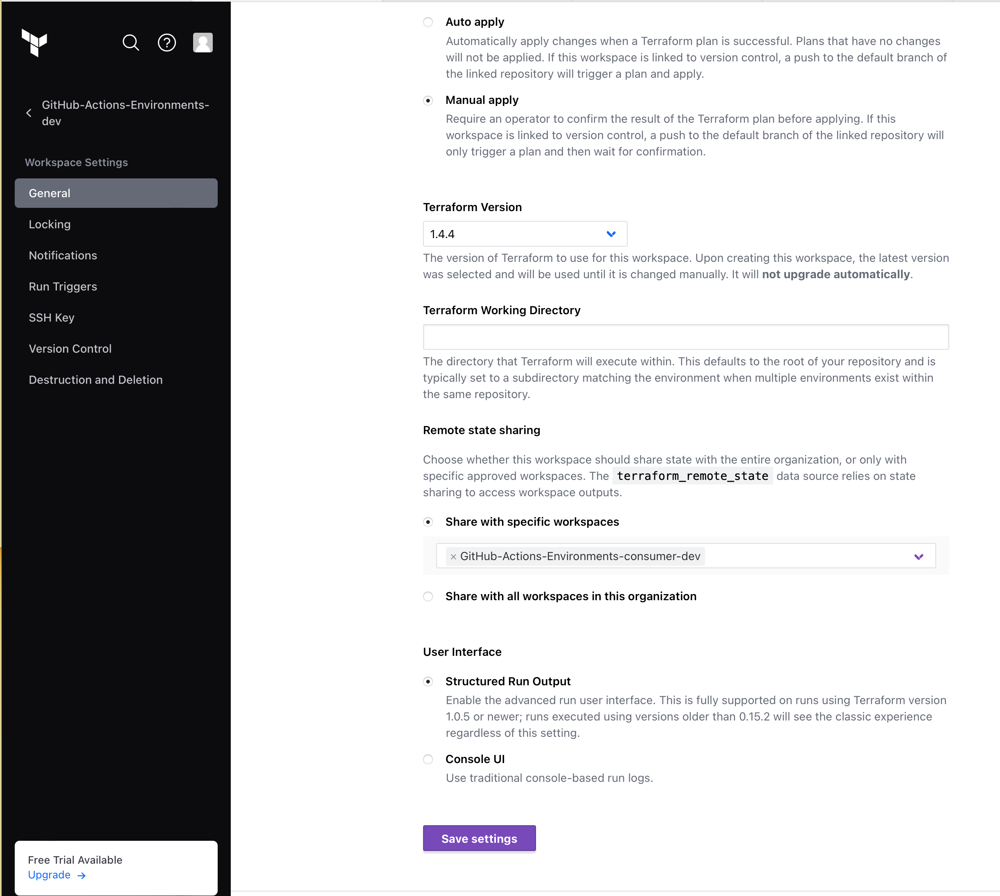

# Project goal

This project goal is to do a simple test of reusing variables from another Terraform Cloud workspace. This project will use a shared output from another workspace as the S3 bucket name. Terraform Cloud allows sharing state information output as, referenced at > https://developer.hashicorp.com/terraform/tutorials/cloud/cloud-run-triggers

This repository has a simple S3 object based on another bucket S3 created from this project >https://github.com/caprica64/github-actions-environment 

## To-Do
[X] Change the Terraform backend model from remote style to cloud {} style.
[X] Complete the read me file update.

## Terraform Cloud sharing state reference

